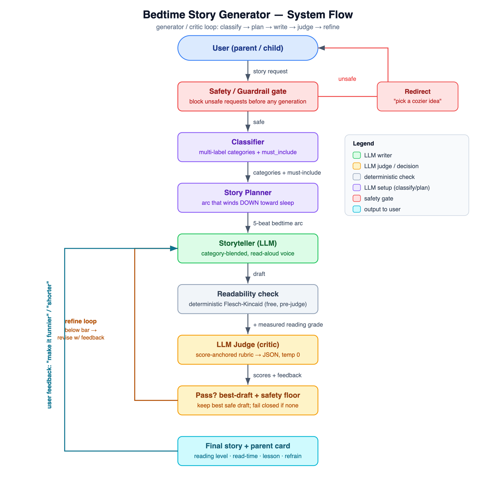

# Bedtime Story Generator (ages 5–10)

Turns a simple request like *"a story about Alice and her cat Bob"* into a
high-quality, age-appropriate bedtime story. Instead of one raw model call, it
runs a **generator/critic loop**: an LLM *judge* scores each draft against a
rubric and feeds specific feedback back to the writer until the story is good
enough to ship.

## Run it

```bash
export OPENAI_API_KEY=sk-...        # your own key; .env is gitignored
python3 main.py                     # interactive story generator
python3 eval.py                     # eval suite: judge scores across sample requests
python3 -m pytest -q                # unit tests (deterministic logic, no API calls)
```

The model is `gpt-3.5-turbo` (unchanged, per the assignment). Requires the
`openai` SDK (v1+).

## Project layout

| File | Contents |
|---|---|
| `main.py` | Orchestration: pipeline, refine loop, deterministic checks, story card, CLI |
| `prompts.py` | All prompt templates + per-category strategies (prompts kept as data, separate from logic) |
| `eval.py` | Integration/regression harness over a fixed request suite |
| `test_main.py` | Unit tests for the deterministic logic (no API calls) |

## Block diagram



*(Vector source: [block_diagram.svg](block_diagram.svg).)*

## How it works

| Stage | File ref | What it does |
|---|---|---|
| **Safety gate + classifier** | `classify_request` | One structured-JSON call screens the request for bedtime-safety and extracts **multi-label categories** + characters/setting/moral + a **`must_include`** list of concrete asks (a fact, a named character, an event). Routes to a blended per-category strategy. |
| **Planner** | `plan_story` | Plan-then-write: a 5-beat arc whose energy **decreases** at the end so the child calms down. |
| **Storyteller** | `write_story` / `storyteller_system` | Role-prompted, category-tailored writer with hard constraints (simple words, short sentences, calm ending, a repeatable refrain). |
| **Deterministic check** | `readability_grade` | Free Flesch-Kincaid grade estimate — catches reading-level problems without spending judge tokens. |
| **LLM Judge** | `judge_story` | Separate critic persona scores 7 rubric dimensions incl. **coverage** of the `must_include` list (safety, calming-ending & coverage weighted double) and returns concrete edits as JSON. |
| **Refine loop** | `generate_story` | Feeds judge feedback back to the writer, capped at `MAX_REVISIONS` for cost/latency. Keeps the **best-scoring** draft (a later rewrite can regress), and **fails closed** — a draft below the safety floor is never eligible to ship, and if nothing clears it, no story is returned. |
| **Parent story card** | `format_story_card` | After the story, prints a card: title, the **computed reading level** (*"Grade 2 · ~2 min read"*), category, the lesson, and a chantable refrain if the story repeats one. Reuses the readability metric as a product feature; degrades gracefully (omits the refrain when none is found, and never breaks the read if formatting fails). |
| **Feedback loop** | `main` | After shipping, the user can request live changes ("make it funnier"). |

## Prompting & agent-design strategies

- **Multi-label category routing** — a request can blend types (e.g. `funny` +
  `educational`); the writer guidance is blended, and a `must_include` list makes
  concrete asks impossible to silently drop.
- **Plan-then-write (decomposition)** — outline the arc before writing prose.
- **Generator/critic separation** — the judge runs as a *different persona* so it
  critiques honestly instead of rubber-stamping its own output.
- **Score-anchored, structured-JSON evaluation** — every rubric dimension defines
  what a 10 / 5 / 1 looks like, and the judge runs at temperature 0. This makes
  scoring repeatable (judging the same story 3× returns identical scores) instead
  of drifting run-to-run, so the loop is programmable, not vibes.
- **Reflexion / self-refine** — judge feedback drives targeted rewrites.
- **Cheap-check-first** — deterministic readability gate before the LLM judge.

## Design choices worth calling out

- **Bedtime wind-down is a hard rubric criterion.** A generic "write a kids' story"
  prompt ends on excitement; the judge here specifically fails endings too
  stimulating for sleep.
- **Read-aloud focus.** Stories are *heard*, so the writer is told to include a
  short repeatable refrain the child can chant along with.
- **Safety is layered and fails closed** — a pre-gate, a double-weighted judge
  dimension, *and* a hard safety floor: a story that scores below the floor is
  never shipped even if its other scores are high. For a healthcare-adjacent
  product, "fail safe" beats "ship something."
- **Best-draft tracking** — the loop returns the highest-scoring safe draft it
  saw, not just the last one, so a regressing rewrite can't lower the output.

## Testing & evaluation

Two layers, split by what's deterministic:

- **`test_main.py` (unit tests, `pytest`)** — the deterministic logic: readability
  math, JSON repair, strategy blending, classifier defaults, and the pipeline's
  draft-selection logic (best-draft tracking, safety fail-closed, readability
  tiebreak) tested by **mocking the LLM boundary**. 15 tests, no API calls, <1s.
- **`eval.py` (integration/regression)** — runs a fixed suite (one per category +
  a blend + a safety case) through the real pipeline and reports each story's
  judge score and reading grade plus a suite average. Run it before and after a
  prompt change to see whether quality moved. Latest run averaged **9.0/10** with
  the safety case correctly refused.

The LLM calls are non-deterministic and cost money, so they live in the eval
harness; everything free and deterministic is unit-tested.

## Future work (with 2 more hours)

Given more time, I'd grow the storyteller–judge loop into a fuller parent-facing
product **without weakening the safety-first design it's built on** — every new
capability would pass *through* the judge, never around it.

- **Route revisions back through the judge.** Today a follow-up like *"make it
  funnier"* goes straight to the writer and **skips the judge + safety floor**, so
  a safe draft could regress after an edit. Routing every revision through the
  same pipeline the first draft clears is the most important correctness fix — and
  it's small, since the pipeline already exists.
- **Parent controls.** The classifier already extracts categories and
  `must_include`; I'd add explicit knobs — target age, length, and tone (calming
  vs. adventurous) — that feed the planner and the reading-level target, reusing
  the readability metric the story card already computes. This turns a one-shot
  generator into an assistant that adapts to a specific child and routine.
- **Validate-then-illustrate.** Rather than generate an image from the raw
  request, produce an image prompt *only from the judge-approved story text*, so
  any illustration inherits the same guardrails the story passed.
- **Personalization memory.** A tiny local profile (child's name, recurring
  characters like Alice and Bob) so *"another story with Bob"* recalls him next
  session — the feature that makes it feel nightly-usable.
- **Retry with backoff.** Wrap the model calls in exponential-backoff retry so a
  transient rate-limit (429) or server error self-heals instead of failing the
  run. Today such errors are caught and reported clearly, but not retried.
- **Lighter touches.** Surface all seven judge sub-scores (already computed; only
  overall + weakest are shown today) so it's clear which criterion drags quality;
  a per-run token counter; and a small web UI + optional text-to-speech for
  hands-free, terminal-free use.
